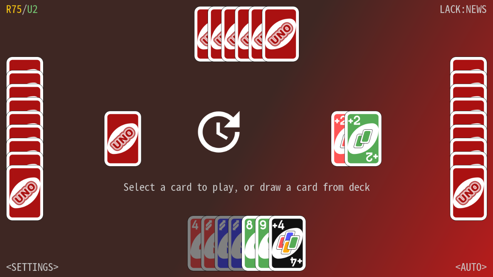

# UNO Card Game for LÖVE

A simple UNO card game against 1-3 AI players (2, 3 or 4 players total, set from `<SETTINGS>`), for
[LÖVE](https://love2d.org) 11.x.
(Developed and tested with LÖVE 11.5 on Windows. The game only uses LÖVE's cross-platform API, so it should
also run on macOS, Linux and, through [love-android](https://github.com/love2d/love-android), Android.)



This is a Lua port of [UnoCard](https://github.com/shiawasenahikari/UnoCard) by Hikari Toyama
(originally C++/Qt on PC, and Java on Android). The game rules, the four AI strategies, the UI layout,
the resources and the texts (English, 简体中文, 日本語) are the original's.

## Running

Install LÖVE 11.x (tested with 11.5), then, in this directory:

```
love .
```

Optional arguments:

| Argument            | Meaning                                                              |
|---------------------|----------------------------------------------------------------------|
| `<number>`          | Random seed (like the original's first argument).                    |
| `--lang=en\|zh\|ja` | Language. It can also be changed in the settings screen (`<EN>` etc.). |

Other ways to run it:

* `./build.ps1` (or `./build.sh`) creates `dist/UnoCard.love`, which runs with `love dist/UnoCard.love`
  (or by dragging it onto love.exe).
* `./build.ps1 -Exe` also creates `dist/UnoCard-win64/`, a stand-alone Windows folder with `UnoCard.exe`.

## Controls

Everything is played with the mouse (or touch). `F11` (or `Alt+Enter`) toggles fullscreen. The window
can be resized freely; the game keeps its 16:9 shape.

* **Click a card** to select it (it rises), **click it again** to play it. Cards that are not legal are dark.
* **Click the deck** (left of the table) to draw a card.
* **`<AUTO>`** lets the AI play your turns until the game ends.
* **`<SETTINGS>`** opens the settings: BGM, sound effects, speed, difficulty, game mode, special rules, the
  number of initial cards, and the language. (Difficulty and rules can be changed between games only.)
* After a game, **`<SAVE>`** stores a replay. On the welcome screen, **`<LOAD>`** lists your replays (or
  drop a `.sav` file onto the window) and plays them back.

Your score, the settings and the replays are stored in LÖVE's save directory
(`%APPDATA%\LOVE\UnoCard` on Windows, `~/.local/share/love/UnoCard` on Linux,
`~/Library/Application Support/LOVE/UnoCard` on macOS).

Scoring: 200 points are deducted when a game starts (so quitting mid-game costs you 200), and given back when
it ends. If you win, you also get the total value of your opponents' remaining cards; if someone else wins, you
lose the value of your remaining cards. (Wild cards are worth 50, action cards 20, number cards their number.
In 2vs2 the differences are doubled and count for the whole team.)

## How to play

1. Each player draws 7 cards. Play passes to the left to start (YOU → WEST → NORTH → EAST).
2. Match the top card of the discard pile either by color or by content. For example, on a green 7 you must
   play a green card, or a 7 of another color. Or you may play any **wild** or **wild +4** card. If you have
   nothing that matches, or you don't want to play what you have, draw a card. A drawn card that can be
   played may be played immediately (see the *When you draw a playable card* setting). Otherwise play moves
   on to the next player.
3. **+2** (Draw Two): the next player draws 2 cards and forfeits their turn. Playable on a matching color or
   on another +2.
4. **Reverse**: the direction of play is reversed. Playable on a matching color or another Reverse. With only
   2 players it acts like a Skip instead (there's only one other seat to reverse towards): you go again.
5. **Skip**: the next player loses their turn. Playable on a matching color or another Skip.
6. **Wild**: you choose the color to continue with (it can stay the same). Playable at any time.
7. **Wild +4**: choose the next color, and the next player draws 4 cards and forfeits their turn. But you may
   only play it when you have no card matching the color of the previously played card. If you suspect your
   previous player played a +4 illegally, you can challenge them: they must show their hand to you. If they
   were guilty they draw the 4 cards instead; if not, you draw the 4 cards plus 2 more.
8. Before playing your next-to-last card you must say "UNO". In this game it's said automatically. The first
   player to play their last card wins.

### Special rules

Independent on/off toggles, set from `<SETTINGS>`'s second page (see `docs/gameversions.md` for the survey
of other UNO releases' mechanics this is drawn from, and which ones might be added next):

* **7-0** — When someone plays a 7, they swap hands with another player. When anyone plays a 0, everybody
  passes their hand to the next player in the direction of play. (4 players.)
* **2vs2** — You and NORTH are a team against WEST and EAST; the team wins when either member plays out their hand.
* **Stack** — +2 (and optionally +4) cards can be stacked on each other; the first player who can't stack
  draws everything. When +4 is stackable it can be played at any time, but it doesn't change the color.
* **Draw to match** — When you draw because you have nothing to play, keep drawing until you draw a card you
  can play (instead of stopping after one card either way).
* **Wild +4 challenge** — Turn off to make a Wild +4 unchallengeable: it's always safe to play, whatever's in
  your hand.
* **Bullseye targeting** — Whoever plays a +2 or Skip picks who it hits, instead of it always being the next
  player. (With only 2 players there's only one possible target, so it resolves immediately with no picker.)

## What's different from the original

* **Framework**: LÖVE instead of Qt. The Android app (a separate Java code base with a vendored OpenCV) is not
  needed: LÖVE runs on Android itself.
* **Structure**: the Qt event loop that blocks in `threadWait()` became coroutines, so `src/game.lua` reads like
  `main.cpp`. The screen is still a retained 1600×900 image with partial repaints, shown scaled (and now
  letterboxed instead of stretched).
* **Settings and replays** live in the save directory (settings as a small text file instead of the binary
  `UnoCard.stat`). There is no file dialog in LÖVE, so `<LOAD>` shows a list of the saved replays; files can
  also be dropped onto the window.
* **Language** is a setting (`<EN>` / `<中文>` / `<日本語>` in the settings screen) instead of depending on the
  name of the executable.
* **Random numbers** come from LÖVE, so a seed does not give the same deals as the original.
* **Fonts**: the bundled Noto Sans Mono CJK collection is loaded as its first face (Japanese). Chinese text uses
  the Japanese glyph variants of shared characters.
* Small fixes: the Chinese "game over" line colors a score change like the other languages (red = loss).
  One suspected upstream slip is kept on purpose so that the AI plays exactly like the original's: the AI's
  best-color logic checks the *next* player's hand size for all three opponents (`src/ai.lua`).

## Project layout

```
main.lua, conf.lua      LÖVE entry points
src/defs.lua            colors, contents, player ids
src/card.lua            Card
src/player.lua          Player (hand, strong/weak color estimations)
src/uno.lua             the rules engine: deck, legality, play/draw/challenge, 7-0, replays
src/ai.lua              AI: easy, hard, 7-0, 2vs2, plus color / swap / challenge decisions
src/i18n.lua            en / zh / ja texts
src/game.lua            UI, screen painting, input, game flow
resource/               images, sounds, BGM, font (from the original)
tests/                  headless & UI tests (see below)
```

## Tests

The tests run inside LÖVE, with `love . --test=<name>` (use `lovec` on Windows to see the output):

| Test        | What it does                                                                                     |
|-------------|--------------------------------------------------------------------------------------------------|
| `selfplay`  | Plays thousands of full games with all seats on AI, in every mode / stack rule / force-play rule / difficulty, checking card conservation, the legality table against an independent rules spec, the AI's picks, termination, and that each saved replay reproduces the final position. |
| `humanplay` | The same, but *you* are a script that only uses mouse clicks (select/play cards, color wheel, challenge, keep-or-play, 7-0 targets, `<AUTO>`). |
| `realtime`  | Plays one game in real time to test the timing, animations and click blocking.                   |
| `persist`   | Settings across restarts, dropped replay files, broken replay files, letterboxed mouse mapping.  |
| `uishots`   | Saves screenshots of every screen (for eyeballing) to the test save directory.                   |

The tests use their own save directories (`UnoCard-test`, `UnoCard-persist-test`), so they never modify your
score, settings and replays.

## Acknowledgements

* Original game: [UnoCard](https://github.com/shiawasenahikari/UnoCard) by Hikari Toyama.
* The card images are from [Wikipedia](https://commons.wikimedia.org/wiki/File:UNO_cards_deck.svg).
* The background music is from:
  [兔子跳儿童欢快音乐_站长素材](https://sc.chinaz.com/yinxiao/210502415031.htm)
* Font: Noto Sans Mono CJK, by Google / Adobe (SIL Open Font License 1.1).

## License

    Copyright 2022 Hikari Toyama

    Licensed under the Apache License, Version 2.0 (the "License");
    you may not use this file except in compliance with the License.
    You may obtain a copy of the License at

        http://www.apache.org/licenses/LICENSE-2.0

    Unless required by applicable law or agreed to in writing, software
    distributed under the License is distributed on an "AS IS" BASIS,
    WITHOUT WARRANTIES OR CONDITIONS OF ANY KIND, either express or implied.
    See the License for the specific language governing permissions and
    limitations under the License.

This is a modified version (a port to Lua and LÖVE) of the original work; see the header of each source file.
